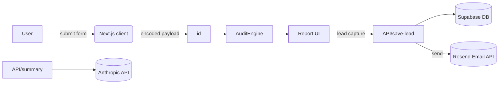

# Architecture

## Overview

AI Spend Audit is a server-rendered Next.js 15 App Router application with a small server API layer. Core logic (audit engine) is deterministic and runs on server or client. Leads and confirmations are stored in Supabase; summary emails are sent with Resend; human summary text is generated with Anthropic.

## Data Flow

## Scaling to 10k audits/day

- Audit engine is O(n) per report; for 10k/day ~ 0.12/s average — trivial for serverless.
- Use edge caching for repeated result pages.
- Store heavy reports in DB and serve static pages via ISR or prerender.
- Use Supabase read replicas and connection pooling for high lead volumes.

## Why this stack

- Next.js App Router for modern routing and Vercel compatibility.
- Supabase for serverless DB and quick auth-free storage.
- Anthropic for human-quality summaries.
- Zod + React Hook Form for robust client-side validation.

## Security

- Keep service keys server-only (SUPABASE_SERVICE_KEY, ANTHROPIC_API_KEY, RESEND_API_KEY).
- Rate-limit lead endpoint server-side; honeypot field in client form.
